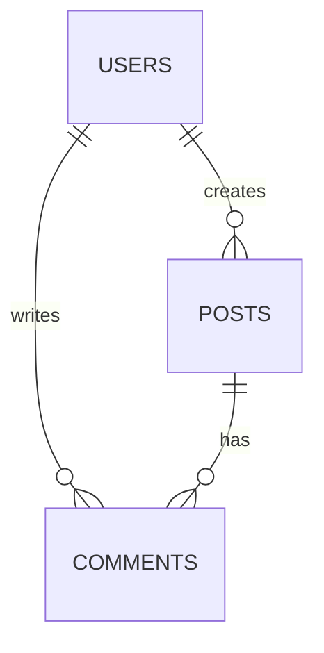

# Database Schema Design

## Level 1: Overview

Design robust and normalized database schemas with ERD visualization, normalization principles, and comprehensive documentation generation.

## Prerequisites

- Understanding of data requirements
- Knowledge of application domain
- Familiarity with database concepts

## What This Skill Does

1. Analyzes application data requirements
2. Applies normalization principles (1NF to BCNF)
3. Defines relationships between entities
4. Generates ERD diagrams (Mermaid format)
5. Creates SQL CREATE statements
6. Produces documentation (data dictionaries, HTML)

---

## Level 2: Quick Start

### Schema Design Workflow

**Step 1: Define entities and attributes**
```
Example: Social media app needs users, posts, comments
- users: id, username, email, created_at
- posts: id, user_id, content, created_at
- comments: id, post_id, user_id, content, created_at
```

**Step 2: Identify relationships**
```
- 1 user has many posts (1-to-many)
- 1 post has many comments (1-to-many)
- 1 user has many comments (1-to-many)
```

**Step 3: Apply normalization**
```
- Remove redundant data
- Separate repeated groups
- Ensure atomic values
- Aim for 3NF minimum
```

**Step 4: Generate ERD**


**Step 5: Create SQL**
```sql
CREATE TABLE users (
  id SERIAL PRIMARY KEY,
  username VARCHAR(50) UNIQUE NOT NULL,
  email VARCHAR(255) UNIQUE NOT NULL
);

CREATE TABLE posts (
  id SERIAL PRIMARY KEY,
  user_id INTEGER REFERENCES users(id),
  content TEXT NOT NULL
);
```

### Documentation Generation

**Step 1: Connect to existing database**
```bash
# Analyze schema structure
Connect to database and extract metadata
```

**Step 2: Generate documentation**
```bash
# Create data dictionary, ERD, HTML docs
Generate database documentation for 'mydb'
```

**Step 3: Review and publish**
- Review generated docs for accuracy
- Store in version control with code
- Share with team for onboarding

---

## Common Use Cases

### Case 1: Design New Application Database
Starting new project, design schema from requirements, create ERD for team review, generate SQL for database creation.

### Case 2: Normalize Existing Schema
Inherited poorly designed database with redundancy. Analyze, apply normalization, decompose tables, create migration plan.

### Case 3: Document Legacy Database
Undocumented production database. Auto-generate data dictionary, ERD diagrams, HTML docs for team knowledge base.

---

## Best Practices

1. **Normalization**
   - Aim for 3NF minimum (reduce redundancy)
   - Consider BCNF for complex scenarios
   - Denormalize for performance only when needed

2. **Relationships**
   - Use foreign keys for referential integrity
   - Choose appropriate relationship types
   - Consider cascading deletes carefully

3. **Indexing**
   - Index foreign keys
   - Index frequently queried columns
   - Don't over-index

4. **Documentation**
   - Keep docs in version control
   - Update after schema changes
   - Include design decisions and rationale

5. **Naming Conventions**
   - Consistent naming (snake_case or camelCase)
   - Clear, descriptive names
   - Avoid reserved keywords

---

## Normalization Forms

- **1NF** - Atomic values, no repeating groups
- **2NF** - 1NF + no partial dependencies
- **3NF** - 2NF + no transitive dependencies
- **BCNF** - 3NF + no dependency on non-key attributes

---

## Troubleshooting

| Issue | Solution |
|-------|----------|
| ERD too complex | Break into logical groups/modules |
| Can't decide on relationships | Analyze use cases, data access patterns |
| Normalization seems excessive | Consider denormalization for read-heavy tables |
| Documentation outdated | Automate regeneration in CI/CD pipeline |
| Team confusion on schema | Hold schema review session with ERD |

---

## Integration

- **Visualization Tools** - dbdiagram.io, draw.io, Mermaid
- **Documentation Generators** - SchemaSpy, DbDoc
- **Migration Tools** - Flyway, Liquibase, Alembic
- **Version Control** - Store ERDs and docs with code
